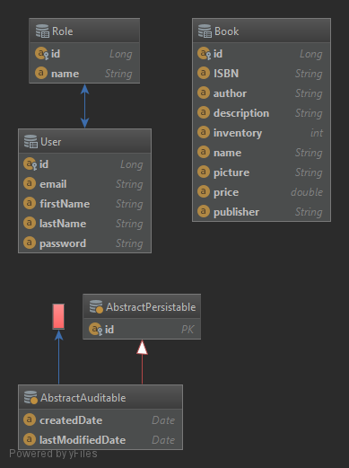

# 

Amazin is an [Amazon] inspired online book store written in Java, using the [Spring Web MVC] framework and [JPA].

[Amazon]: https://amazon.com
[Spring Web MVC]: https://docs.spring.io/spring/docs/current/spring-framework-reference/web.html
[JPA]: https://www.ibm.com/support/knowledgecenter/en/SSEQTP_liberty/com.ibm.websphere.wlp.doc/ae/cwlp_jpa.html

## Features

Amazin is considered a proof-of-concept/simulation of an online book store since it simulates purchases of books and does not actually allow or attempt to complete credit card payments. Amazin is being developed as a learning process for the entire software development life cycle, working as a team, learning the Spring MVC framework, continous integration, and web application technologies.

- book store owners can upload, edit, or remove books - book information and inventory
- users can view/browse through the current books in the book store
- allow searching for books based on name and other fields
- the state of the bookstore is persisted permanently in PostgreSQL
- users can add books to cart
- shopping cart is saved to the users account and persists even after logging out
- users can 'purchase' books, ensuring book purchases do not exceed inventory, where users first put the books in their shopping cart then proceed to checkout
- shows users book recommendations based on their searches

# UML Class Diagram

# Entity Relationship Diagram

## License

"Amazon" is an official trademark of Amazon.com, Inc. This work is not formally related to, endorsed by, or affiliated with Amazon or Amazon.com Inc.

Amazin is available under the MIT License; see [LICENSE](LICENSE) for details.
